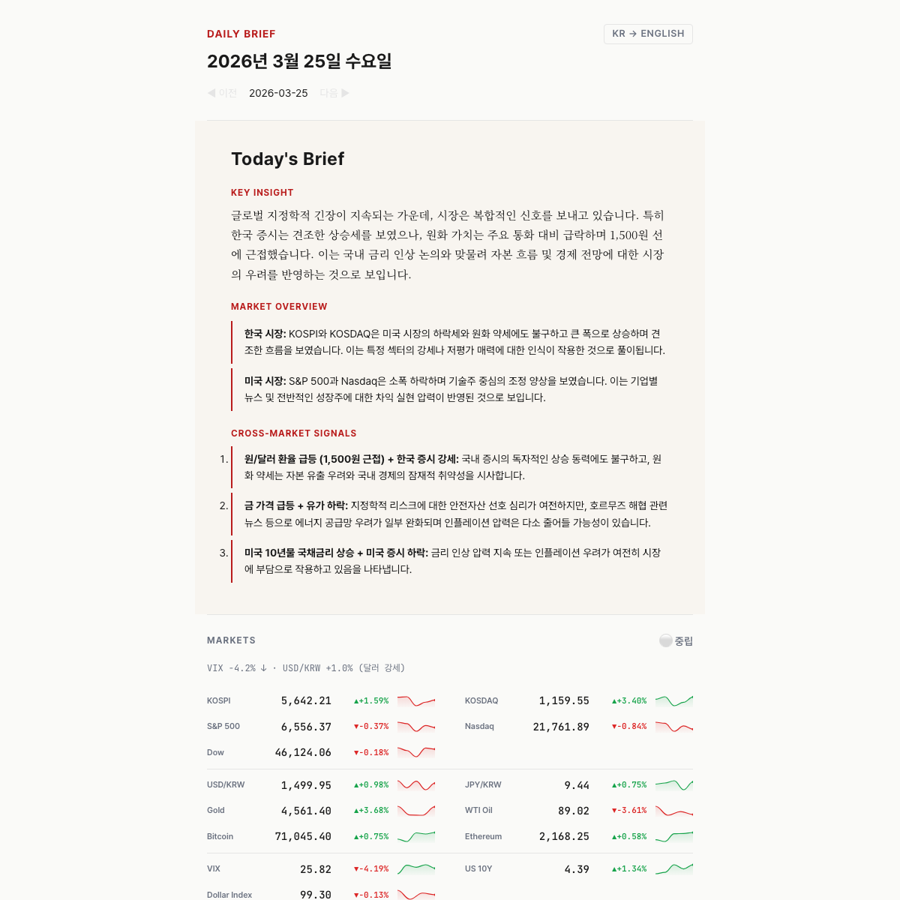

<p align="center">
  
</p>

<h1 align="center">Daily Brief</h1>

<p align="center">
  <strong>투자자와 의사결정자를 위한 AI 모닝 브리핑</strong><br/>
  한국 + 미국 시장 · 글로벌 & 국내 뉴스 · AI 교차 분석<br/>
  매일 아침 자동 생성 — Gemini 3.1 Pro 기반.
</p>

<p align="center">
  <a href="https://kipeum86.github.io/daily-brief/">🌐 라이브 데모</a> ·
  <a href="https://kipeum86.github.io/daily-brief/en/">🌐 English Version</a> ·
  <a href="README.md">🇺🇸 English README</a>
</p>

<p align="center">
  
  
  
  
</p>

---

## 이게 뭔가요?

**Daily Brief**는 매일 아침 KST 06:30에 시장 데이터, 글로벌 뉴스, 국내 뉴스, AI 에디토리얼 분석을 결합하여 전문적인 모닝 브리핑을 자동 생성합니다.

나만의 **Economist "World in Brief"** — 한국 투자자에게 맞춤화되고, 완전 자동화되며, Gemini 3.1 Pro가 구동합니다.

<p align="center">
  <a href="https://kipeum86.github.io/daily-brief/">
    
  </a>
</p>

## 주요 기능

### 📊 시장 데이터
- **14개+ 티커** — KOSPI, KOSDAQ, S&P 500, Nasdaq, Dow, USD/KRW, Gold, Oil, BTC, ETH, VIX, US 10Y, Dollar Index
- **S&P 섹터 ETF** — 11개 섹터 미니 히트맵 (일일 등락률 컬러 칩)
- **스파크라인 SVG** — 5일 추세선, 큐빅 베지어 스무딩 + 그라디언트 필
- **Market Pulse** — VIX + FX + 주식 시그널을 결합한 Risk-On/Off 게이지
- **휴장 감지** — KOSPI/NYSE 휴장 자동 감지 + 사유 표시 (예: "Good Friday"), "Market closed" 배너
- **네이버 증권 Primary** — 한국 지수는 네이버 증권 API 우선 (안정적, 실시간), yfinance 폴백
- **폴백** — 글로벌은 yfinance 기본, FRED API 보조 (리스크 지표용)

### 📰 뉴스
- **글로벌** — Reuters, BBC World, The Guardian, Al Jazeera, AP News, NPR (다양한 시각, 페이월 없음)
- **한국** — 7대 메이저 매체 RSS (연합뉴스, 조선, 중앙, 동아, 한겨레, 한경, 매경) + 네이버 검색 API (보조 키워드 검색)
- **중복 제거** — URL 정규화 + 토픽 토큰 유사도 + 교차 실행 이력
- **교차 실행 중복 제거** — 어제 나온 기사는 다시 나오지 않음

### 🤖 AI 분석
- **Gemini 3.1 Pro** (자동 폴백 체인 포함; Claude provider는 config로 사용 가능)
- **에디토리얼 인사이트** — "Key Insight", "Market Overview", "Cross-Market Signals"
- **데이터 나열이 아닌 스토리** — AI가 시장, 환율, 원자재, 뉴스 이벤트 간의 연결고리를 분석
- **이중 언어** — 한국어/영어 인사이트를 각각 독립 생성 (번역이 아님)

### 🌐 이중 언어 (KR/EN)
- **완전한 언어 토글** — UI 라벨만이 아니라 콘텐츠 전체가 전환
- 한국어 버전: 영어 뉴스 → 한국어로 번역
- 영어 버전: 한국 뉴스 → 영어로 번역
- 섹션 제목은 양쪽 모두 영어 (에디토리얼 컨벤션)

### 🛡️ 배포 전 검증 게이트
- **5개 자동 체크** — 시장 데이터 정합성, AI 팩트체크, 번역 완전성, 콘텐츠 완전성, HTML 렌더링
- **시장 교차검증** — 네이버 증권 vs 수집 데이터, 잘못된/지연된 가격 감지
- **AI 방향 체크** — "코스피 폭등"인데 실제 -4%면 잡아냄 (환각 방지)
- **한국 뉴스 순도** — 국제 뉴스(이란, 러시아)가 한국 섹션에 혼입 차단, 잡뉴스(인사발령, 부고) 필터링
- **번역 체크** — 월드 뉴스가 한국어인지(KO), 한국 뉴스가 영어인지(EN) 확인
- **실패 시 배포 차단** — 체크 실패 시 이메일 미발송 + 배포 스킵
- **운영 알림** — 실패한 게이트는 GitHub Actions summary에 기록되고 발신자에게만 알림 가능

### 📧 이메일 발송
- **Gmail SMTP** — 별도 서비스 불필요, 무료
- **BCC** — 수신자끼리 이메일 주소가 노출되지 않음
- **스마트 제목** — "Daily Brief · 3월 25일 — VIX 급등, 위험 회피 심리 심화"
- **구독자 파일** — `subscribers.txt` (gitignore 처리, 로컬 전용)

### 🗄️ 아카이브
- **날짜 네비게이션** — ◀▶ 과거 브리핑 탐색
- **/archive 페이지** — 전체 과거 브리핑 목록
- **Google Sheets** — 시장 데이터 + 뉴스를 시트에 아카이빙 (선택 사항)

### 🎨 디자인
- **Economist × FT** 에디토리얼 스타일 — 대시보드가 아닌 신문 1면
- **타이포그래피** — Noto Serif KR (인사이트), Pretendard (UI), JetBrains Mono (숫자)
- **색상** — 따뜻한 아이보리 `#FAFAF8`, Economist 레드 `#B91C1C`, 데이터 전용 컬러
- **모바일 퍼스트** — 출퇴근길 확인용으로 설계
- **AI 슬롭 제로** — 카드 그리드, 보라색 그라디언트, 제네릭 SaaS 패턴 없음

---

## 빠른 시작

### 1. Fork & Clone

```bash
git clone https://github.com/kipeum86/daily-brief.git
cd daily-brief
```

### 2. API 키 발급

| 서비스 | 용도 | 발급처 |
|--------|------|--------|
| **Google AI Studio** | Gemini AI (브리핑 + 번역) | [aistudio.google.com/apikey](https://aistudio.google.com/apikey) |
| **네이버 개발자센터** | 한국 뉴스 검색 | [developers.naver.com](https://developers.naver.com) → 검색 API |
| **Gmail** | 이메일 발송 | [앱 비밀번호](https://myaccount.google.com/apppasswords) (2단계 인증 필요) |
| FRED | 경제 지표 (선택 사항) | [fred.stlouisfed.org](https://fred.stlouisfed.org/docs/api/api_key.html) |

### 3. 설정

```bash
cp .env.example .env          # API 키 입력
cp subscribers.example.txt subscribers.txt  # 수신자 이메일 추가
```

**`.env`**
```env
GOOGLE_API_KEY=your_gemini_key
NAVER_CLIENT_ID=your_naver_id
NAVER_CLIENT_SECRET=your_naver_secret
GMAIL_ADDRESS=your@gmail.com
GMAIL_APP_PASSWORD=xxxx_xxxx_xxxx_xxxx
```

**`subscribers.txt`** (한 줄에 이메일 하나, gitignore 처리)
```
you@email.com
friend@email.com
```

### 4. 로컬 실행

```bash
python -m venv venv && source venv/bin/activate
pip install -r requirements.txt

python main.py --dry-run        # 이메일 없이 테스트
python main.py                  # 이메일 포함 전체 실행
python main.py --no-llm         # AI 없이 데이터만
python main.py --date 2026-03-20  # 특정 날짜로 생성
```

출력: `output/index.html` (한국어) + `output/en/index.html` (영어)

### 5. GitHub Actions 배포

repo → Settings → Secrets → Actions에 아래 **시크릿** 추가:

| 시크릿 | 값 |
|--------|-----|
| `GOOGLE_API_KEY` | Gemini API 키 |
| `NAVER_CLIENT_ID` | 네이버 Client ID |
| `NAVER_CLIENT_SECRET` | 네이버 Client Secret |
| `GMAIL_ADDRESS` | 발신 Gmail 주소 |
| `GMAIL_APP_PASSWORD` | Gmail 앱 비밀번호 |
| `SUBSCRIBERS` | 수신자, 쉼표 구분 |

**GitHub Pages 활성화**: Settings → Pages → Source: `gh-pages` 브랜치.

워크플로우는 **KST 06:30 (UTC 21:30) 월–금** 자동 실행됩니다.

수동 실행: Actions 탭 → "Morning Brief" → "Run workflow".

---

## 아키텍처

```
daily-brief/
├── main.py                          # 파이프라인 오케스트레이터 + CLI
├── config.yaml                      # 데이터 소스, RSS 피드, LLM 모델
├── subscribers.txt                  # 이메일 수신자 (gitignore 처리)
├── .github/workflows/
│   └── morning-brief.yml            # Cron: KST 06:30 월-금
│
├── pipeline/
│   ├── markets/
│   │   ├── collector.py             # yfinance + FRED (ThreadPoolExecutor)
│   │   ├── naver.py                 # 네이버 증권 API (한국 지수 Primary)
│   │   ├── holidays.py              # KR/US 휴장일 캘린더 + 사유
│   │   └── indicators.py            # 포맷팅, 휴장, 마켓 펄스, 스파크라인
│   ├── news/
│   │   ├── collector.py             # RSS 피드 수집
│   │   ├── naver.py                 # 네이버 뉴스 검색 API
│   │   ├── dedup.py                 # 3단계 중복 제거
│   │   └── filters.py              # 키워드 필터링
│   ├── ai/
│   │   ├── briefing.py              # AI 인사이트 생성 (이중 언어)
│   │   ├── prompts.py               # Economist 스타일 프롬프트 엔지니어링
│   │   └── translate.py             # 뉴스 번역 (KO↔EN)
│   ├── llm/
│   │   ├── base.py                  # 추상 프로바이더 인터페이스
│   │   ├── gemini.py                # Google Gemini
│   │   └── claude.py                # Anthropic Claude
│   ├── render/
│   │   ├── dashboard.py             # Jinja2 → HTML (KO + EN)
│   │   └── email.py                 # 인라인 CSS HTML 이메일
│   ├── verify/
│   │   ├── gate.py                  # 배포 전 검증 오케스트레이터
│   │   └── checks/                  # 5개 daily + 1개 weekly 체크 모듈
│   │       ├── market_data.py       # 가격, 범위, 휴장, 네이버 교차검증
│   │       ├── insight.py           # AI 방향 일치, 휴장 서술 체크
│   │       ├── translation.py       # KO/EN 번역 완전성
│   │       ├── content.py           # 기사 수, 한국 뉴스 순도, 중복
│   │       ├── html.py              # DOM 무결성, 네비, 언어 토글
│   │       └── weekly.py            # 주간 리캡 검증
│   └── deliver/
│       ├── mailer.py                # Gmail SMTP (BCC)
│       └── sheets.py                # Google Sheets 아카이브
│
├── templates/
│   ├── dashboard/
│   │   ├── base.html                # Economist × FT 에디토리얼 레이아웃
│   │   └── archive.html             # 과거 브리핑 목록
│   └── email/
│       └── brief.html               # 이메일 템플릿 (인라인 CSS, JS 없음)
│
└── output/                          # 생성된 정적 사이트 → GitHub Pages
    ├── index.html                   # 최신 (한국어)
    ├── en/index.html                # 최신 (영어)
    └── archive/                     # 날짜별 과거 브리핑
```

## 파이프라인 흐름

```
KST 06:30 (GitHub Actions cron)
    │
    ├── 1. 시장 ──→ yfinance (14개 티커) + FRED 폴백
    │                ThreadPoolExecutor 병렬 수집
    │
    ├── 2. 뉴스 ──→ RSS (글로벌 10개 + 한국 메이저 7개) + 네이버 API
    │                3단계 중복 제거 → 키워드 필터
    │
    ├── 3. AI ────→ Gemini 3.1 Pro
    │                한국어 인사이트 + 영어 인사이트 (독립 생성)
    │                번역: 글로벌 뉴스→KO, 한국 뉴스→EN
    │
    ├── 4. 렌더 ──→ Jinja2 템플릿
    │                한국어 HTML + 영어 HTML
    │                Markdown→HTML (AI 인사이트)
    │
    ├── 5. 검증 ──→ 배포 전 게이트 (5개 체크)
    │                시장 데이터 ✓ AI 팩트체크 ✓ 번역 ✓
    │                콘텐츠 순도 ✓ HTML 무결성 ✓
    │                실패 → 이메일 + 배포 차단
    │
    ├── 6. 발송 ──→ Gmail SMTP (BCC) + Google Sheets
    │
    └── 7. 배포 ──→ peaceiris/actions-gh-pages → GitHub Pages
```

## 커스터마이징

### LLM 프로바이더 변경

```yaml
# config.yaml
llm:
  provider: "gemini"           # gemini, claude
  model: "gemini-3.1-pro-preview"   # 작업별 모델이 없을 때 쓰는 기본값
  analysis_model: "gemini-3.1-pro-preview"
  selection_model: "gemini-2.5-flash"
  translation_model: "gemini-2.5-flash"
```

### 시장 티커 추가/제거

```yaml
# config.yaml
markets:
  crypto:
    tickers: ["BTC-USD", "ETH-USD", "SOL-USD"]  # Solana 추가
    names: ["Bitcoin", "Ethereum", "Solana"]
```

### 뉴스 소스 변경

```yaml
# config.yaml — 한국 메이저 매체 (RSS)
news:
  korea_major:
    - name: "연합뉴스"
      url: "https://www.yna.co.kr/rss/news.xml"
    # 매체 추가/제거 가능

# 네이버 키워드 검색 (보조)
  korea:
    source: "naver"
    queries: ["반도체 수출", "금리 한국은행", "부동산 정책"]
```

## 장애 대응 (Graceful Degradation)

모든 컴포넌트는 독립적으로 실패합니다:

| 컴포넌트 | 실패 시 | 사용자에게 보이는 것 |
|----------|---------|---------------------|
| yfinance | FRED 폴백 → 해당 티커 스킵 | "Data unavailable" 표시 |
| RSS 피드 | 실패한 소스 스킵 | 뉴스 항목 감소 |
| 한국 RSS | 실패한 매체 스킵 | 나머지 매체는 정상 |
| 네이버 API | 키워드 검색 스킵 | 메이저 매체 RSS는 정상 |
| Gemini AI | 인사이트 스킵 | 데이터 전용 브리핑 |
| Gmail | 이메일 스킵 | 대시보드는 정상 배포 |
| Google Sheets | 아카이빙 스킵 | 나머지 전부 정상 동작 |

| 검증 게이트 | 이메일 + 배포 차단 | `verification-log.json`, GitHub Actions summary, 발신자 전용 알림 메일 |

브리핑은 **항상 생성됩니다** — 다만 검증 실패 시 잘못된 정보 발송을 방지하기 위해 이메일/배포가 차단됩니다.

## 비용

| 컴포넌트 | 비용 |
|----------|------|
| Gemini 3.1 Pro | ~$1/월 (2.5 Pro → 2.5 Flash 폴백 포함) |
| yfinance / RSS / Naver | 무료 |
| GitHub Actions | 무료 (2,000분/월, ~110분 사용) |
| GitHub Pages | 무료 |
| Gmail SMTP | 무료 (500건/일 제한) |
| **합계** | **~$1/월** |

## 로드맵

- [x] 주간 리캡
- [x] Plotly.js 트리맵 히트맵 (Finviz 스타일)
- [x] 배포 전 검증 게이트 (팩트체크 + 완전성)
- [ ] 월간 리캡 (계획; CLI에는 아직 노출하지 않음)
- [ ] JSON API 출력 (위젯 연동용)
- [ ] iOS 위젯 (Scriptable)
- [ ] macOS 위젯 (Übersicht)
- [ ] 다크 테마 토글
- [ ] 경제 캘린더 (FOMC, 고용 데이터)
- [ ] 포트폴리오 연동

## 라이선스

[Apache License 2.0](LICENSE) 하에 배포됩니다.

---

<p align="center">
  Built with <a href="https://claude.ai/claude-code">Claude Code</a> · Powered by <a href="https://ai.google.dev/">Gemini</a><br/>
  <sub>Economist × FT 에디토리얼 디자인 · Gemini 3.1 Pro 기반</sub>
</p>
