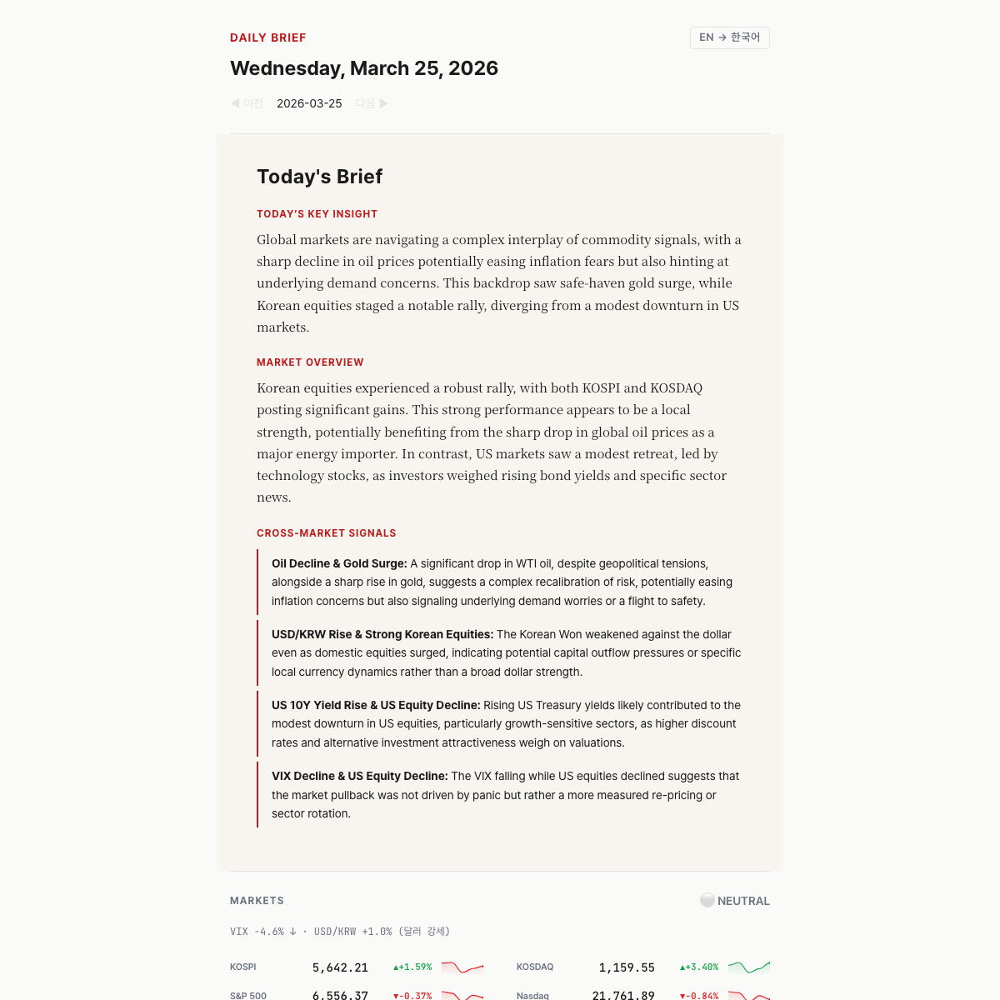

<p align="center">
  
</p>

<h1 align="center">Daily Brief</h1>

<p align="center">
  <strong>AI-powered morning briefing for investors & decision-makers</strong><br/>
  Korean + US markets · Global & domestic news · AI cross-market analysis<br/>
  Delivered every morning — powered by Gemini 3.1 Pro.
</p>

<p align="center">
  <a href="https://kipeum86.github.io/daily-brief/">🌐 Live Demo</a> ·
  <a href="https://kipeum86.github.io/daily-brief/en/">🌐 English Version</a> ·
  <a href="README.ko.md">🇰🇷 한국어 안내</a>
</p>

<p align="center">
  
  
  
  
</p>

---

## What is this?

**Daily Brief** generates a professional morning briefing every day at 6:30 AM KST — combining market data, global news, domestic Korean news, and AI-driven editorial analysis into a single, beautiful static page.

Think of it as your personal **Economist "World in Brief"** — but tailored for Korean investors, fully automated, and powered by Gemini 3.1 Pro.

<p align="center">
  <a href="https://kipeum86.github.io/daily-brief/en/">
    
  </a>
</p>

## Key Features

### 📊 Markets
- **14+ tickers** — KOSPI, KOSDAQ, S&P 500, Nasdaq, Dow, USD/KRW, Gold, Oil, BTC, ETH, VIX, US 10Y, Dollar Index
- **S&P Sector ETFs** — 11 sectors as a mini heatmap (colored chips showing daily performance)
- **Sparkline SVGs** — 5-day trend lines with cubic bezier smoothing and gradient fill
- **Market Pulse** — Risk-On/Off gauge combining VIX + FX + equity signals
- **Holiday detection** — Auto-detects KOSPI/NYSE closures with reason (e.g. "Good Friday"), shows "Market closed" banners
- **Naver Finance primary** — Korean indices via Naver Finance API (reliable, real-time), yfinance as fallback
- **Fallback** — yfinance primary for global, FRED API fallback for risk indicators

### 📰 News
- **Global** — Reuters, BBC World, The Guardian, Al Jazeera, AP News, NPR (diverse perspectives, no paywall)
- **Korea** — 7 major outlets via RSS (연합뉴스, 조선, 중앙, 동아, 한겨레, 한경, 매경) + Naver Search API (supplementary keyword search)
- **3-stage dedup** — URL canonicalization → topic token similarity → EventKey hash
- **Cross-run dedup** — Won't repeat yesterday's stories

### 🤖 AI Analysis
- **Gemini 3.1 Pro** (with automatic fallback chain; pluggable — supports Claude and OpenAI too)
- **Editorial insight** — "Key Insight", "Market Overview", "Cross-Market Signals"
- **Not a data dump** — AI connects the dots between markets, FX, commodities, and news events
- **Bilingual** — Korean and English insights generated independently (not translated)

### 🌐 Bilingual (KR/EN)
- **Full language toggle** — not just UI labels, the entire content switches
- Korean version: English news → translated to Korean
- English version: Korean news → translated to English
- Section headings in English for both versions (editorial convention)

### 🛡️ Pre-Deploy Verification
- **5 automated checks** before email/deploy — market data integrity, AI fact-check, translation completeness, content completeness, HTML rendering
- **Market cross-validation** — Naver Finance vs collected data, catches stale/wrong prices
- **AI direction check** — Detects "KOSPI surged" when data shows -4% (prevents hallucination)
- **Korea purity** — Blocks international news (Iran, Russia) from Korea section, filters junk (인사발령, 부고)
- **Translation check** — Ensures world news is in Korean (KO version), Korean news in English (EN version)
- **Gate blocks deploy** — If any check fails, email is not sent and deploy is skipped

### 📧 Email Delivery
- **Gmail SMTP** — no extra service needed, free
- **BCC** — subscribers don't see each other's emails
- **Smart subject** — "Daily Brief · Mar 25 — VIX surges as risk-off sentiment deepens"
- **Subscribers file** — `subscribers.txt` (gitignored, local-only)

### 🗄️ Archive
- **Date navigation** — ◀▶ browse past briefings
- **/archive page** — full listing of all past briefings
- **Google Sheets** — market data + news archived for trend analysis (optional)

### 🎨 Design
- **Economist × FT** editorial style — not a dashboard, a newspaper front page
- **Typography** — Noto Serif KR (insight), Pretendard (UI), JetBrains Mono (numbers)
- **Color** — Warm ivory `#FAFAF8`, Economist red `#B91C1C`, data-only colors
- **Mobile-first** — designed for checking on your commute
- **No AI slop** — no card grids, no purple gradients, no generic SaaS patterns

---

## Quick Start

### 1. Fork & Clone

```bash
git clone https://github.com/kipeum86/daily-brief.git
cd daily-brief
```

### 2. Get API Keys

| Service | Purpose | Get it |
|---------|---------|--------|
| **Google AI Studio** | Gemini AI (briefing + translation) | [aistudio.google.com/apikey](https://aistudio.google.com/apikey) |
| **Naver Developers** | Korean news search | [developers.naver.com](https://developers.naver.com) → 검색 API |
| **Gmail** | Email delivery | [App Passwords](https://myaccount.google.com/apppasswords) (requires 2FA) |
| FRED | Economic indicators (optional) | [fred.stlouisfed.org](https://fred.stlouisfed.org/docs/api/api_key.html) |

### 3. Configure

```bash
cp .env.example .env          # Add your API keys here
cp subscribers.example.txt subscribers.txt  # Add email recipients
```

**`.env`**
```env
GOOGLE_API_KEY=your_gemini_key
NAVER_CLIENT_ID=your_naver_id
NAVER_CLIENT_SECRET=your_naver_secret
GMAIL_ADDRESS=your@gmail.com
GMAIL_APP_PASSWORD=xxxx_xxxx_xxxx_xxxx
```

**`subscribers.txt`** (one email per line, gitignored)
```
you@email.com
friend@email.com
```

### 4. Run Locally

```bash
python -m venv venv && source venv/bin/activate
pip install -r requirements.txt

python main.py --dry-run        # Test without email
python main.py                  # Full run with email
python main.py --no-llm         # Data only, skip AI
python main.py --date 2026-03-20  # Generate for a specific date
```

Output: `output/index.html` (Korean) + `output/en/index.html` (English)

### 5. Deploy with GitHub Actions

Add these **Secrets** in your repo → Settings → Secrets → Actions:

| Secret | Value |
|--------|-------|
| `GOOGLE_API_KEY` | Gemini API key |
| `NAVER_CLIENT_ID` | Naver Client ID |
| `NAVER_CLIENT_SECRET` | Naver Client Secret |
| `GMAIL_ADDRESS` | Sender Gmail address |
| `GMAIL_APP_PASSWORD` | Gmail app password |
| `SUBSCRIBERS` | Recipients, comma-separated |

Enable **GitHub Pages**: Settings → Pages → Source: `gh-pages` branch.

The workflow runs automatically at **KST 06:30 (UTC 21:30) Mon–Fri**.

Manual trigger: Actions tab → "Morning Brief" → "Run workflow".

---

## Architecture

```
daily-brief/
├── main.py                          # Pipeline orchestrator + CLI
├── config.yaml                      # Data sources, RSS feeds, LLM model
├── subscribers.txt                  # Email recipients (gitignored)
├── .github/workflows/
│   └── morning-brief.yml            # Cron: KST 06:30 Mon-Fri
│
├── pipeline/
│   ├── markets/
│   │   ├── collector.py             # yfinance + FRED (ThreadPoolExecutor)
│   │   ├── naver.py                 # Naver Finance API (Korean indices primary)
│   │   ├── holidays.py              # KR/US holiday calendar with names
│   │   └── indicators.py            # Formatting, holidays, market pulse, sparklines
│   ├── news/
│   │   ├── collector.py             # RSS feed collection
│   │   ├── naver.py                 # Naver News Search API
│   │   ├── dedup.py                 # 3-stage deduplication
│   │   └── filters.py              # Keyword filtering
│   ├── ai/
│   │   ├── briefing.py              # AI insight generation (bilingual)
│   │   ├── prompts.py               # Economist-style prompt engineering
│   │   └── translate.py             # News translation (KO↔EN)
│   ├── llm/
│   │   ├── base.py                  # Abstract provider interface
│   │   ├── gemini.py                # Google Gemini
│   │   └── claude.py                # Anthropic Claude
│   ├── render/
│   │   ├── dashboard.py             # Jinja2 → HTML (KO + EN)
│   │   └── email.py                 # Inline-CSS HTML email
│   ├── verify/
│   │   ├── gate.py                  # Pre-deploy verification orchestrator
│   │   └── checks/                  # 5 daily + 1 weekly check modules
│   │       ├── market_data.py       # Price, range, holiday, Naver cross-val
│   │       ├── insight.py           # AI direction match, holiday narration
│   │       ├── translation.py       # KO/EN translation completeness
│   │       ├── content.py           # Article count, Korea purity, overlap
│   │       ├── html.py              # DOM integrity, nav, lang toggle
│   │       └── weekly.py            # Weekly recap verification
│   └── deliver/
│       ├── mailer.py                # Gmail SMTP (BCC)
│       └── sheets.py                # Google Sheets archive
│
├── templates/
│   ├── dashboard/
│   │   ├── base.html                # Economist × FT editorial layout
│   │   └── archive.html             # Past briefings listing
│   └── email/
│       └── brief.html               # Email template (inline CSS, no JS)
│
└── output/                          # Generated static site → GitHub Pages
    ├── index.html                   # Latest (Korean)
    ├── en/index.html                # Latest (English)
    └── archive/                     # Past briefings by date
```

## Pipeline Flow

```
KST 06:30 (GitHub Actions cron)
    │
    ├── 1. Markets ──→ yfinance (14 tickers) + FRED fallback
    │                   ThreadPoolExecutor parallel fetch
    │
    ├── 2. News ────→ RSS (10 global + 7 Korean major) + Naver API
    │                   3-stage dedup → keyword filter
    │
    ├── 3. AI ──────→ Gemini 3.1 Pro
    │                   Korean insight + English insight (independent)
    │                   Translate: world news→KO, korea news→EN
    │
    ├── 4. Render ──→ Jinja2 templates
    │                   Korean HTML + English HTML
    │                   Markdown→HTML for AI insight
    │
    ├── 5. Verify ─→ Pre-deploy gate (5 checks)
    │                   Market data ✓ AI fact-check ✓ Translation ✓
    │                   Content purity ✓ HTML integrity ✓
    │                   FAIL → block email & deploy
    │
    ├── 6. Deliver ─→ Gmail SMTP (BCC) + Google Sheets
    │
    └── 7. Deploy ──→ peaceiris/actions-gh-pages → GitHub Pages
```

## Customization

### Change LLM Provider

```yaml
# config.yaml
llm:
  provider: "gemini"           # gemini, claude, openai
  model: "gemini-2.5-flash"   # any model supported by the provider
```

### Add/Remove Market Tickers

```yaml
# config.yaml
markets:
  crypto:
    tickers: ["BTC-USD", "ETH-USD", "SOL-USD"]  # Add Solana
    names: ["Bitcoin", "Ethereum", "Solana"]
```

### Change News Sources

```yaml
# config.yaml — Korean major outlets (RSS)
news:
  korea_major:
    - name: "연합뉴스"
      url: "https://www.yna.co.kr/rss/news.xml"
    # Add/remove outlets here

# Naver keyword search (supplementary)
  korea:
    source: "naver"
    queries: ["반도체 수출", "금리 한국은행", "부동산 정책"]
```

## Graceful Degradation

Every component fails independently:

| Component | If it fails | User sees |
|-----------|-------------|-----------|
| yfinance | FRED fallback → skip ticker | "Data unavailable" for that ticker |
| RSS feeds | Skip failed source | Fewer news items |
| Korean RSS | Skip failed outlet | Other outlets still work |
| Naver API | Skip keyword search | Major outlet RSS still works |
| Gemini AI | Skip insight | Data-only briefing |
| Gmail | Skip email | Dashboard still deploys |
| Google Sheets | Skip archiving | Everything else works |

| Verification gate | Block email + deploy | Errors logged to `verification-log.json` |

The briefing **always generates** — but if verification fails, email/deploy is blocked to prevent sending incorrect information.

## Cost

| Component | Cost |
|-----------|------|
| Gemini 3.1 Pro | ~$1/mo (with 2.5 Pro → 2.5 Flash fallback) |
| yfinance / RSS / Naver | Free |
| GitHub Actions | Free (2,000 min/mo, we use ~110) |
| GitHub Pages | Free |
| Gmail SMTP | Free (500/day limit) |
| **Total** | **~$1/month** |

## Roadmap

- [x] Weekly Recap
- [x] Plotly.js treemap heatmap (Finviz-style)
- [x] Pre-deploy verification gate (fact-check + completeness)
- [ ] Monthly Recap
- [ ] JSON API output for widget integration
- [ ] iOS widget (Scriptable)
- [ ] macOS widget (Übersicht)
- [ ] Dark theme toggle
- [ ] Economic calendar (FOMC, employment data)
- [ ] Portfolio integration

## License

Licensed under the [Apache License, Version 2.0](LICENSE).

---

<p align="center">
  Built with <a href="https://claude.ai/claude-code">Claude Code</a> · Powered by <a href="https://ai.google.dev/">Gemini</a><br/>
  <sub>Economist × FT editorial design · Zero cost to operate</sub>
</p>
